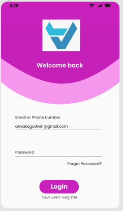

<h1 align="center">JSN</h1>
<p>
">
">
">
</p>

---
The JSN UI, is just basically displaying the user interface of an app. Inorder to further sharpen my skills in creating UI with react native I replicated this UI, I achieved this using figma https://www.figma.com/file/MZDhTPu3AYrWOoH7EaK1wR/JSNReplicated?node-id=0%3A1
##Project SetUp
```

Installation
```
`npm install -g expo-cli `

#Usage
---
Run `expo start` on git bash to view app on emulator

##Preview(What the app should look like)
<p align="center">


</p>
